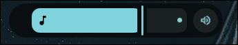

# Material 3 expressive volume
Material 3 Expressive Volume — An Android 16-inspired volume OSD widget for Linux desktop (Quickshell).
<p align="center">
  </img>
</p>

1. Installation:
```bash
git clone https://github.com/yturkin430-pixel/Material-3-expressive-volume.git
cd Material-3-expressive-volume
mkdir -p ~/.config/quickshell/Volume
cp -r * ~/.config/quickshell/Volume
```
2. Dynamic Colors
The following utilities are required for the theme generation to work correctly:
"Matugen", "awww"
```bash
mkdir ~/.config/matugen
nano ~/.config/matugen/config.toml
```
Insert this text into the content of your file:
```toml
[config.wallpaper]
command = "awww"
arguments = ["img", "--transition-type", "simple"]
set = true

[templates.Volume]
input_path = "~/.config/quickshell/Volume/shell.qml.hbs"
output_path = "~/.config/quickshell/Volume/shell.qml"
```
Start generating the theme:
```bash
matugen image PATH/TO/YOUR/WALLPAPERS -m dark --prefer=lightness
```
3. Final step: launch the slider:
```bash
qs -p ~/.config/quickshell/Volume/shell.qml
```
